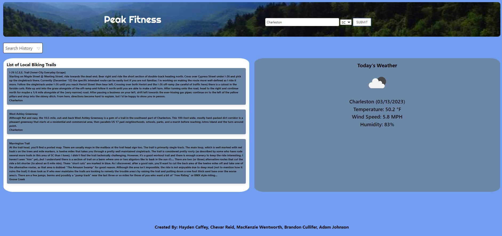
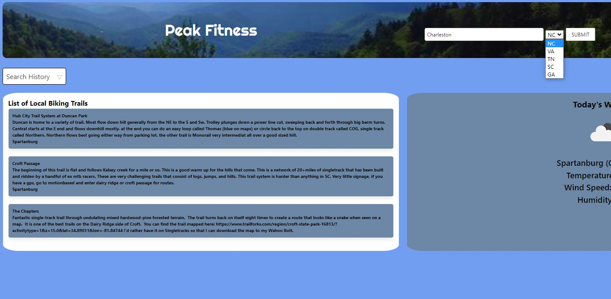
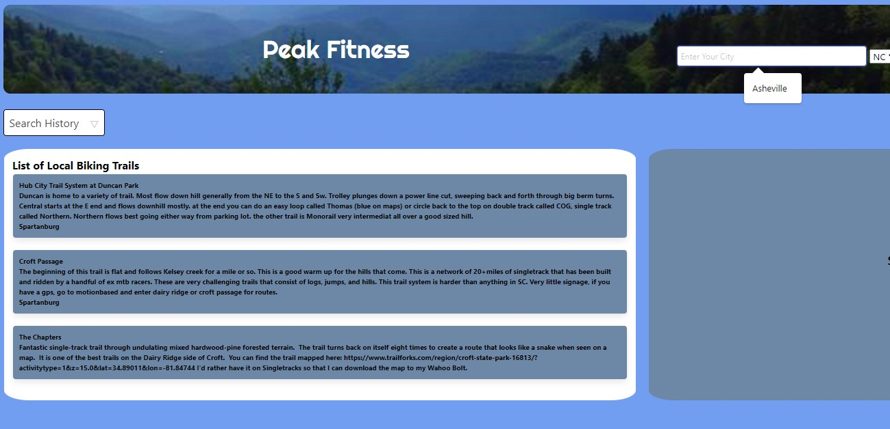
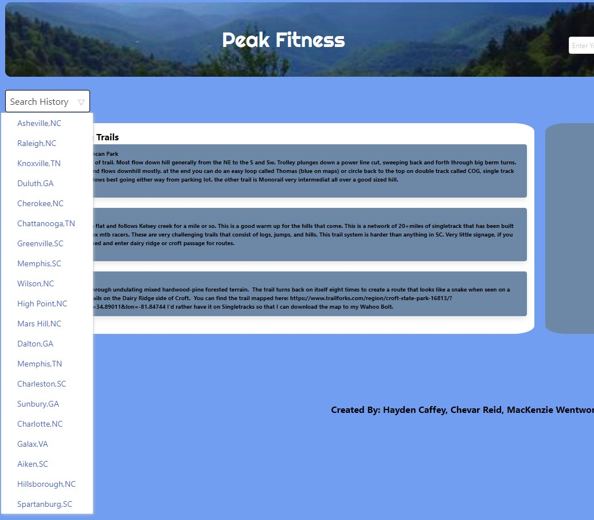

# Peak Fitness 


## Application Links

* GitHub Repository for Application: https://github.com/Brandon5667/peak-fitness

* Deployed Application: https://brandon5667.github.io/peak-fitness/


## Description

### *The Task*

For Project #1 of the *Coding Full Stack Boot Camp*, we were tasked to work in a group to build a web application from scratch that solves a real-world problem.

### *Our Project*

To meet project requirements, our group created a web application called "Peak Fitness" that provides a tool for users to search bike trails and current weather conditions for a particular location. 

Peak Fitness uses a combination of HTML, Bulma CSS framework, JavaScript, and JQuery to render up-to-date data retrieved from two server-side APIs and using client-side storage to store persistent data. Featured in our web application, we used OpenWeather API to display weather data and TrailAPI to display a list of trails.


## Table of Contents 

- [User Story](#user-story)
- [Acceptance Criteria](#acceptance-criteria)
- [Usage](#usage)
- [Technologies Used](#technologies-used)
- [Developing Contributors](#developing-contributors)
- [License](#license)
- [Badges](#badges)


## User Story

```
AS AN outdoor adventurer
I WANT to find my local biking trails and view the local weather forecast
SO THAT I can plan ahead before embarking on a biking trail
```


## Acceptance Criteria

```
GIVEN I am searching for biking trails
WHEN I enter a location and click the submit button
THEN I am presented with a list of trails and current weather conditions for that location
WHEN I select a location from the 'search history'
THEN I am presented with a list of trails and current weather conditions for the selected location
```


## Usage

The following image series demonstrates the appearance and functionality of the "Peak Fitness" web application:










## Technologies Used

* [VS Code](https://code.visualstudio.com/)
* [HTML](https://www.w3schools.com/html/)
* [JavaScript](https://www.w3schools.com/js/)
* [JQuery](https://jquery.com/)
* [Bulma CSS Framework](https://bulma.io/)
* [GitHub Pages](https://pages.github.com/)

### *Server-Side APIs*

* OpenWeather API: https://openweathermap.org/forecast5

* Trails API: https://rapidapi.com/trailapi/api/trailapi


## Developing Contributors

Hayden Caffey, Brandon Cullifer, Chevar Reid, Adam Johnson, and MacKenzie Wentworth


## License
This project is covered under the [MIT License](./LICENSE). For more details, please click the license icon below under 'Badges'.

---

## Badges

[](https://opensource.org/licenses/MIT)